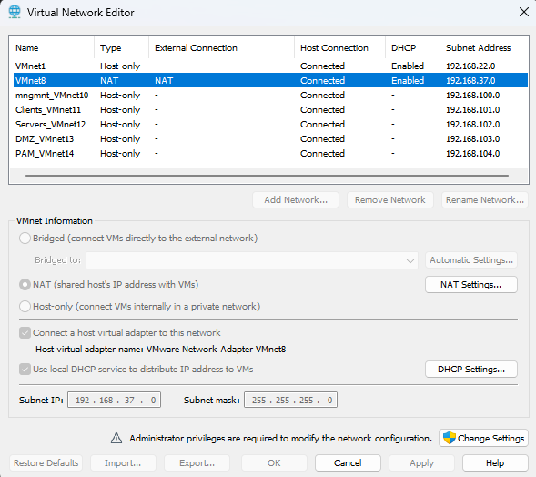
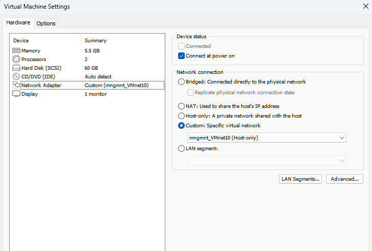
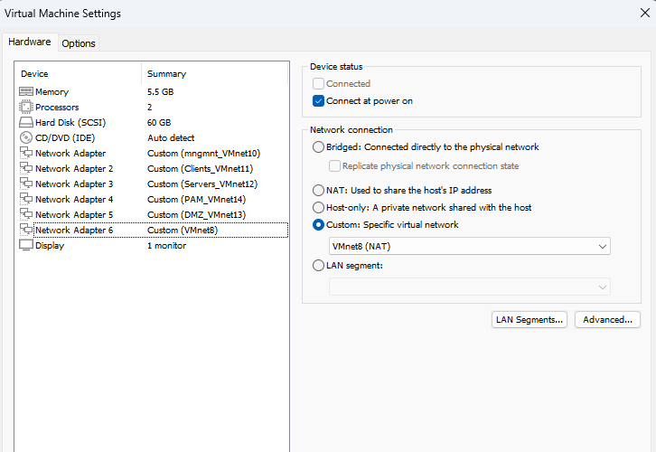
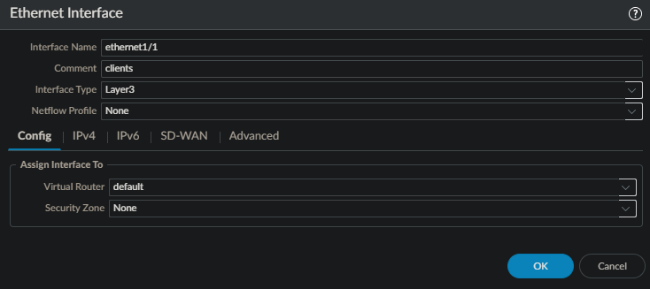
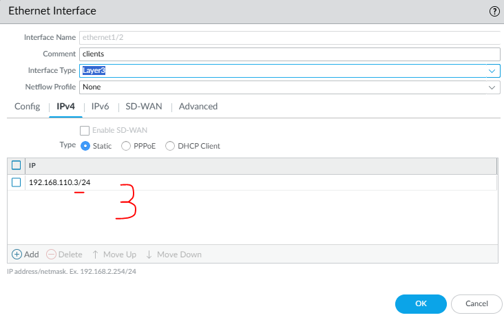
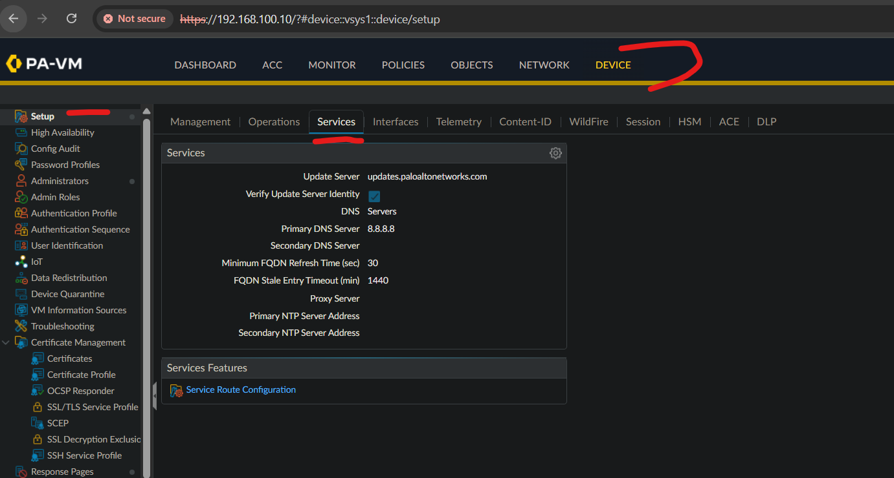
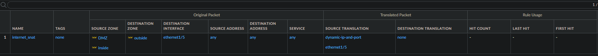
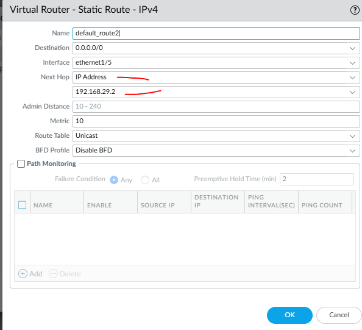
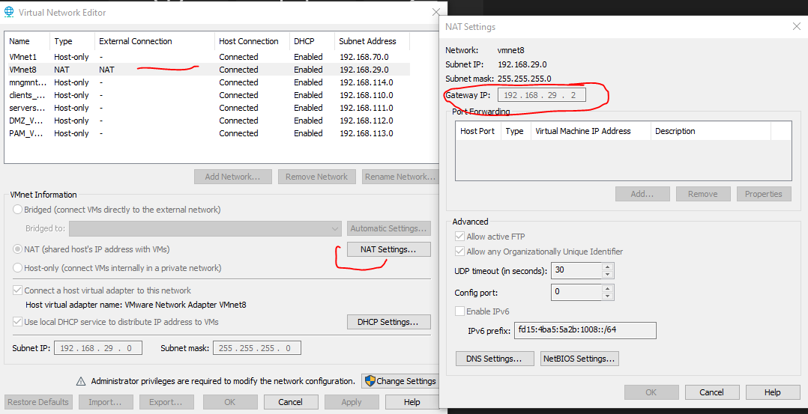
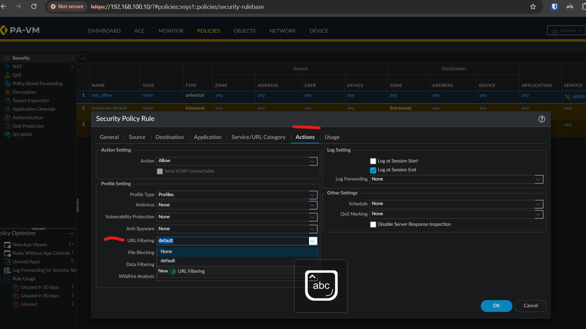

# 🔥 Palo Alto Firewall Lab

## 📦 Quraşdırma tələbləri
- VMware Workstation / Player
- Palo Alto VM image (OVA/OVF)

---

## 🚀 Palo VM quraşdırılması

### 1. VM faylını import edin

### 2. Şəbəkə interfeyslərini konfiqurasiya edin

**Virtual Network Editor ayarları:**

### 3. Köhnə interfeysləri silin, yenilərini əlavə edin

### 4. VM-i başladın və management interfeysini konfiqurasiya edin

**İlkin giriş:**
- İstifadəçi: `admin`
- Şifrə: `admin` (5-6 dəqiqə gözləyin)

### 5. Management interfeysinə IP təyin etmək üçün komandalar:
configure;
set deviceconfig system type static
set deviceconfig system ip-address <IP_ADDRESS> netmask <NETMASK> default-gateway <GATEWAY_IP>
commit;
exit;
show interface management;

text

### 6. Brauzerdə daxil olun

### 7. Digər şəbəkə adapterlərini əlavə edin

### 8. Web UI-da **Device → Interfaces** bölməsini yoxlayın

### 9. **Device → Management → General Settings** - zaman zonasını dəyişin

### 10. Zonalar yaradın
- inside
- outside
- DMZ

---

## ⚙️ İlkin konfiqurasiyalar

### Administrativ istifadəçilər
- Yeni istifadəçi yaradın (admin istifadə etməyin)
- Custom rol yaradın

### Xidmətlər

---

## 🚦 Trafik idarəsi

### NAT konfiqurasiyası

### Static Route

---

## 🔗 URL Filtering

### URL Filtering profile

### Custom URL kateqoriyası

### Test saytı:
[https://urlfiltering.paloaltonetworks.com/](https://urlfiltering.paloaltonetworks.com/)

---

## 📋 External Dynamic Lists (EDL)

---

## 📝 Tapşırıqlar

1. Client maşınından chat, storage, shopping, VPN tətbiqlərini blok edin
2. Custom EDL ilə malicious IP-ləri avtomatik blok edin

---

## 📌 Qeydlər

- VM quraşdırması zamanı 5-6 dəqiqə gözləmək lazımdır
- İlkin şifrə: admin / admin
- Management interfeysi üçün statik IP verin
- WAN interfeysi üçün DHCP client seçin

---

## 🔗 Faydalı linklər

- [Palo Alto Documentation](https://docs.paloaltonetworks.com)
- [URL Filtering Test](https://urlfiltering.paloaltonetworks.com)

---

*Bu qeydlər real laboratoriya təcrübələri əsasında hazırlanmışdır.*
